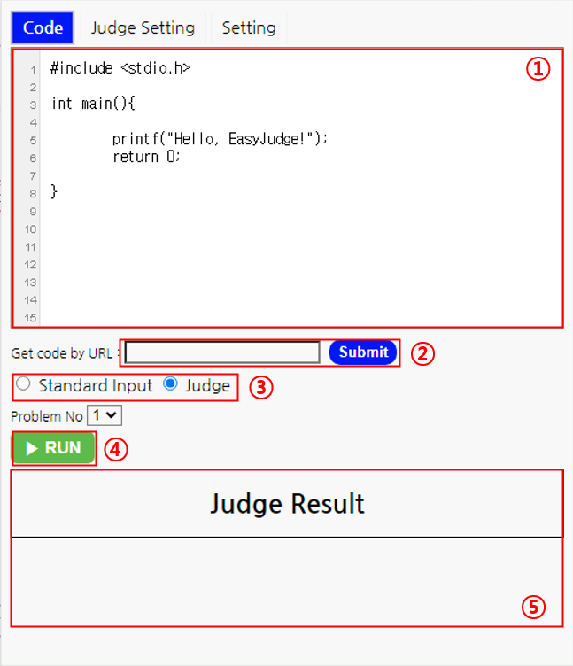
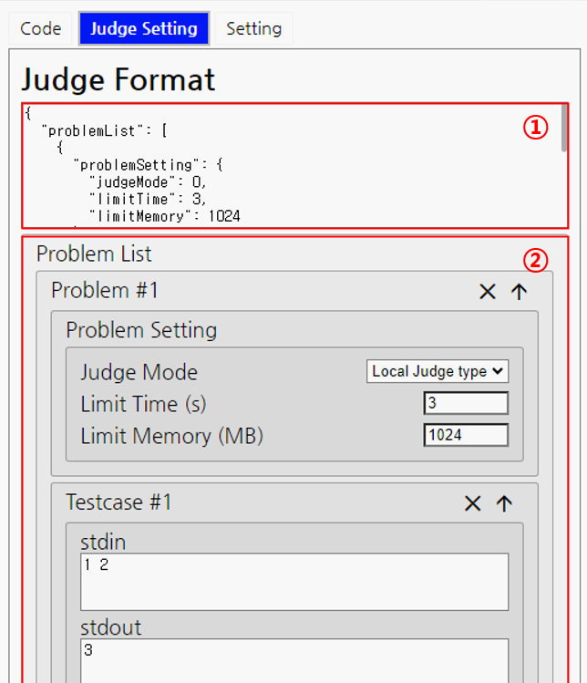
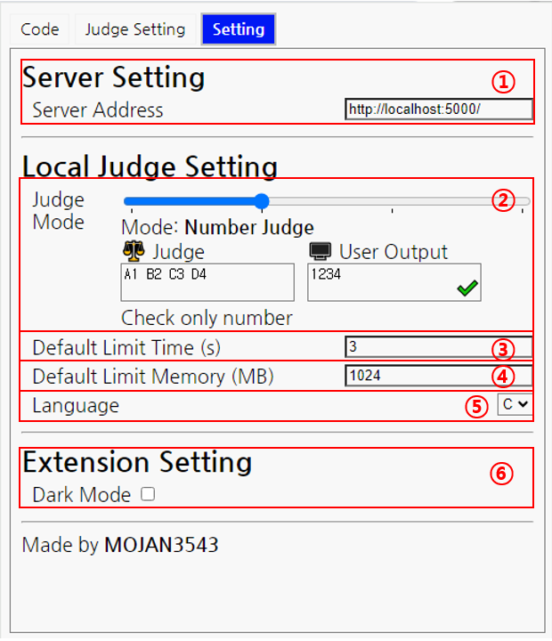

# EasyJudge
## 프로젝트 소개
* 코드 채점을 더 쉽게! 자동으로 코드 실행, 결과 값을 비교 해주는 크롬 익스텐션인 EasyJudge입니다.
* [**EasyJudge Server**](https://github.com/MOJAN3543/EasyJudge_server)와 함께 사용합니다. 
* 표준 입력, 표준 출력 채점 뿐만 아니라 파일 입출력 채점도 지원합니다.
* 채점할 코드 파일을 설치하지 않고, 브라우저 환경에서 코드를 가져와 채점합니다.
* 다양한 채점 기준을 지원합니다.
## 기술 스택
   
## 프로젝트 구조
```
📦ChromeExtension
 ┣ 📂util
 ┃ ┣ 📜domController.js
 ┃ ┣ 📜judge.js
 ┃ ┗ 📜setting.js
 ┣ 📜background.js
 ┣ 📜EasyJudge_Popup.html
 ┣ 📜EasyJudge.png
 ┣ 📜manifest.json
 ┣ 📜Popup.css
 ┣ 📜Popup.js
 ┗ 📜README.md
```
## INSTALL
```bash
$ git clone https://github.com/MOJAN3543/EasyJudge.git
```
해당 레포지토리를 클론 후, [**chrome://extensions/**](chrome://extensions/)에서 `압축해제된 확장 프로그램을 로드합니다.`에서 클론 한 폴더를 선택합니다.  
  
## HOW TO USE
해당 익스텐션은 크게 **Code**탭, **Judge Setting**탭, **Setting**탭으로 나뉩니다.
### Code

#### 1. 코드 블럭
채점할 코드가 작성되어 있는 공간입니다.
#### 2. URL로 코드 가져오기
코드가 저장된 URL을 입력하면 코드를 가져와 자동으로 **코드 블럭**에 입력합니다.
#### 3. 표준 입력 / 채점 모드
사용자가 입력한 `stdin`을 입력으로 사용하는 표준 입력 모드와 문제에 정해진 테스트 케이스에 따라 채점을 하는 채점 모드를 선택합니다.
##### 3.1. 표준 입력 창
`stdin`으로 입력될 표준 입력 값을 작성하는 공간입니다.
##### 3.2. 채점할 문제 번호
채점 할 문제 번호를 선택하는 입력입니다.
#### 4. 실행
**코드 블럭**에 입력된 코드를 **표준 입력 / 채점 모드**에 따라 실행합니다. 채점 모드로 실행 될 경우 자동으로 사용자 출력이 정답인지 아닌지 확인하여 표시합니다.
#### 5. 채점 결과
**실행**을 했을때의 결과를 나타내는 공간입니다.
### Judge Setting

#### 1. 채점 서식
채점 모드로 실행 되었을때, 해당 채점 서식을 기반으로 채점을 진행합니다. 채점 서식의 구조는 다음과 같습니다.  
```json
{
  "problemList": [
    {
      "problemSetting": {
        "judgeMode": 0,
        "limitTime": 3,
        "limitMemory": 1024
      },
      "testcaseList": [
        {
          "stdin": "1 2",
          "stdout": "3",
          "fileList": [
            {
              "filename": "",
              "contents": "",
              "filetype": "input"
            }
          ]
        }
      ]
    }
  ]
}
```
##### 채점 서식
`"problemList"` : 여러개의 문제 서식을 포함합니다. `<list>`  
##### 문제 서식
`"problemSetting"` : 한 문제의 설정을 포함합니다.  `<dict>`  
`"testcaseList"` : 여러개의 테스트 케이스의 서식을 포함합니다. `<list>`
##### 문제 설정 서식
`"judgeMode"` : 채점 기준을 설정합니다. `<int>`
> 0 = 해당 익스텐션의 설정에 따라 채점합니다  
> 1 = 채점하지 않습니다. 항상 정답입니다.  
> 2 = 출력 중, 숫자만 검사합니다.  
> 3 = 출력 중, 공백과 대소문자 구분을 제외한 모두를 검사합니다.  
> 4 = 모든 출력을 검사합니다.  

`"limitTime"` : 제한 시간을 설정합니다. 단위는 `s`이며, 시간 초과시 `Timeout` 에러를 반환합니다. `<int>`  
`"limitMemory"` : 제한 메모리를 설정합니다. 단위는 `MB`이며, 메모리 초과시 `Segfault` 런타임 에러를 반환합니다. `<int>`
##### 테스트케이스 서식
`"stdin"` : 표준 입력(stdin)으로 입력될 값을 설정합니다. `<string>`  
`"stdout"` : 표준 출력(stdout)으로 출력된다면 정답으로 처리할 값을 설정합니다. `<string>`  
`"fileList"` : 여러개의 파일 서식을 포함합니다. `<list>`  
##### 파일 서식
`"filename"` : 파일의 이름을 설정합니다. `<string>`  
`"contents"` : 파일의 내용을 설정합니다. `<string>`  
`"filetype"` : 파일이 input으로 사용될지 output으로 사용될지  설정합니다. `<string>`
> "input" = 파일을 input으로 사용합니다. 코드 실행시 `filename`을 이름으로, `content`를 내용으로 가진 파일을 생성합니다.  
> "output" = 파일을 output으로 사용합니다. 채점시 해당 파일이 생성 되었고 어떤 내용을 가지고 있는지 채점합니다.
#### 2. 채점 서식 GUI
**채점 서식**을 GUI 형태로 수정이 가능합니다.
### Setting
 
#### 1. 채점 서버 주소 설정
채점 서버를 설정 합니다. 채점 서버는 **EasyJudge Server**을 실행 하고 있는 서버여야 합니다.  
#### 2. 채점 기준 설정
채점 기준을 설정합니다. 총 4단계가 있으며 아래 `<textarea>`에서 문자열을 변경하며 채점 결과를 미리 볼 수 있습니다.  
#### 3. 시간 제한 설정
표준 입력 모드에서 실행시 제한할 시간을 설정합니다. 단위는 `s`입니다.  
#### 4. 메모리 제한 설정
표준 입력 모드에서 실행시 제한할 메모리을 설정합니다. 단위는 `MB`입니다.  
#### 5. 실행 언어 설정
코드를 실행할 언어를 설정합니다. 현재는 C언어만 채점할 수 있습니다.
#### 6. 다크모드 설정
익스텐션을 다크모드로 사용 할 수 있습니다.
  
### OTHER
코드가 있는 링크를 우클릭하여 `EasyJudge ― Judge code > Problem # <Number>` 메뉴를 통해 채점이 가능합니다. 해당 메뉴 선택후 익스텐션을 켜는 즉시 해당하는 번호로 채점을 시작합니다.  

## TODO
* 차후 다른 언어도 지원 예정입니다.